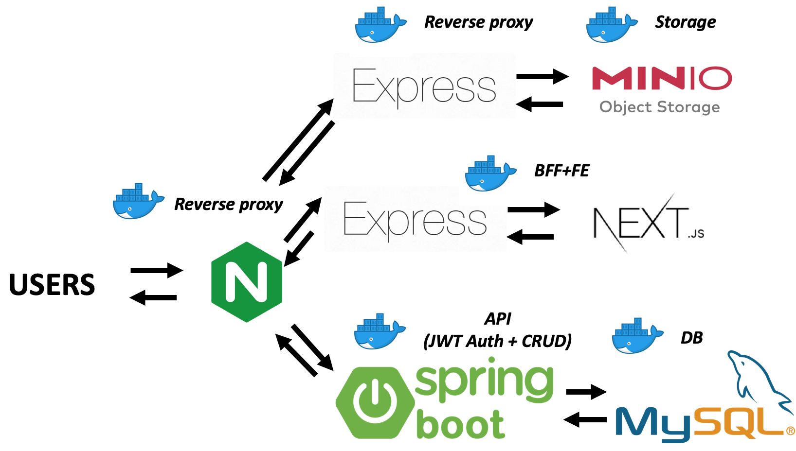

# component-oriented-web-app



- FE
  - React/Next
- BFF
  - Express
- BE API
  - Spring Boot
- DB
  - MySQL
- Auth
  - Spring Security
  - JWT
- Reverse proxy
  - Nginx

```bash
# 起動
docker-compose up --build
# 停止
docker-compose down --volumes

# コンテナ内で確認
docker exec -it <CONTAINER_NAME> bash
```


## References

Thanks

- Architecture
  - https://github.com/callicoder/spring-security-react-ant-design-polls-app
- Next
  - https://github.com/takefumi-yoshii/ts-nextjs-express
- Express
  - https://gist.github.com/mitsuruog/fc48397a8e80f051a145

- Spring Boot App
  - https://www.callicoder.com/spring-boot-spring-security-jwt-mysql-react-app-part-1/
- JWT
  - https://github.com/murraco/spring-boot-jwt
- MySQL
  - https://qiita.com/Manabu-man/items/58d0f98a15656ed65136
